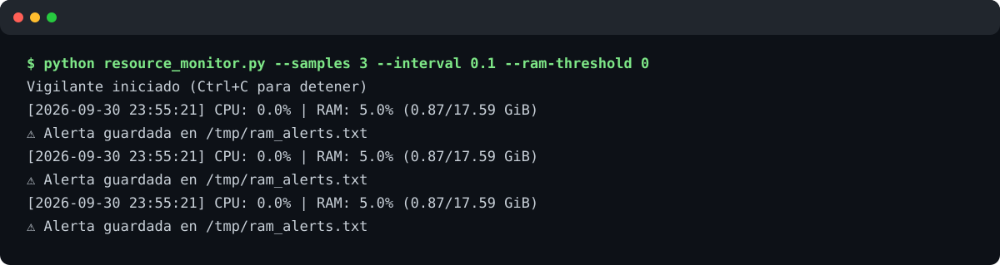
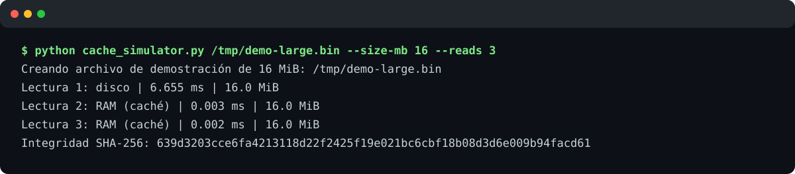
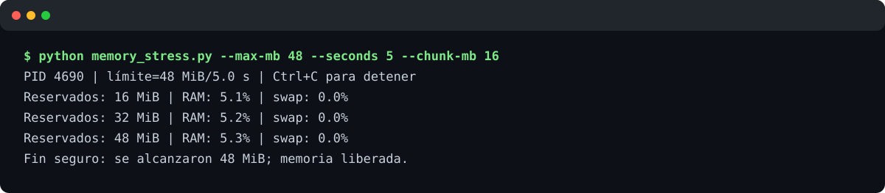
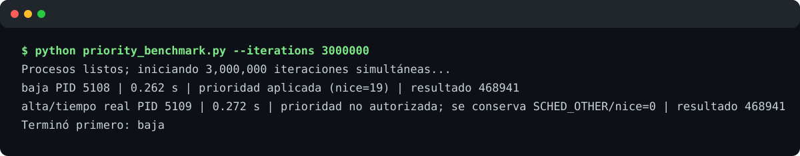

# Manipulación y monitoreo de recursos

Cuatro experimentos reproducibles en Python para observar CPU, RAM, caché, memoria
virtual y planificación de procesos en **Linux**. No requieren paquetes externos:
las métricas se leen de `/proc`, la interfaz que el kernel expone al espacio de usuario.

> [!CAUTION]
> `memory_stress.py` reserva memoria real. Empieza con valores pequeños, conserva el
> límite de memoria disponible y no elimines sus límites de seguridad. Una prueba de
> swap se debe hacer únicamente en una VM o equipo de laboratorio.

## Requisitos e instalación

- Linux y Python 3.10 o posterior.
- Clona el repositorio y, opcionalmente, crea un entorno virtual:

```bash
python3 -m venv .venv
source .venv/bin/activate
python -m pip install -r requirements.txt
```

## Entorno Linux de ejecución

Las ejecuciones y capturas incluidas en este repositorio se realizaron con las
siguientes características:

| Componente | Característica |
|---|---|
| Distribución | Ubuntu 24.04.4 LTS (Noble Numbat) |
| Kernel | Linux 6.18.44, arquitectura x86_64 |
| Procesador | AMD EPYC 9V74; 3 CPU virtuales disponibles |
| Memoria visible | 17 GiB de RAM aproximadamente |
| Memoria swap | No habilitada (`0 B`) |
| Virtualización | Contenedor Docker sobre un hipervisor KVM |
| Python | CPython 3.14.4 |
| Interfaz de ejecución | Terminal Bash, sin entorno gráfico |

Estos datos son importantes al interpretar los resultados. Los tiempos dependen de
la carga del procesador y del almacenamiento; además, la prueba registrada no pudo
mostrar crecimiento de memoria virtual porque el sistema no tenía swap habilitada.
Del mismo modo, el contenedor no disponía del privilegio `CAP_SYS_NICE`, por lo que
Linux rechazó la solicitud de prioridad de tiempo real y el programa conservó
`SCHED_OTHER` para ese proceso. Estas dos limitaciones quedan visibles en las
capturas, en lugar de simular resultados que el sistema no produjo.

## 1. Vigilante de recursos

Muestra CPU y RAM en tiempo real. Cuando RAM es **mayor** que el umbral (80% por
defecto), añade una línea con fecha ISO al archivo `logs/ram_alerts.txt`. Sin
`--samples` continúa hasta recibir `Ctrl+C`.

```bash
python resource_monitor.py
python resource_monitor.py --samples 10 --interval 0.5
```

Para comprobar la ruta de alerta sin llenar RAM, puede usarse temporalmente
`--ram-threshold 0`, como en esta captura:



## 2. Simulador de caché

La primera lectura usa `Path.read_bytes()` y guarda el contenido en un diccionario;
las siguientes devuelven el mismo objeto desde RAM. Se informa el tiempo con
`time.perf_counter()` y se verifica que todas las lecturas tengan el mismo SHA-256.
Si el archivo no existe, el programa crea uno de demostración.

```bash
python cache_simulator.py data/demo_large.bin --size-mb 64 --reads 3
```



> El caché de páginas del propio SO también puede acelerar el disco. La diferencia
> esencial del experimento es que las lecturas 2+ ni siquiera invocan el sistema de
> archivos: salen del diccionario del proceso.

## 3. Estrés de memoria y paginación

Reserva bloques de bytes distintos en un ciclo y presenta RAM y swap. A diferencia
de un bucle infinito peligroso, siempre termina al alcanzar `--max-mb`, `--seconds`,
`Ctrl+C`, un `MemoryError`, o cuando queda menos de `--min-available-mb` de memoria.

```bash
python memory_stress.py --max-mb 256 --seconds 30 --min-available-mb 512
```



Para observar paginación, incrementa `--max-mb` **gradualmente dentro de una VM** y
mira en otra terminal `watch -n 1 'free -h'`. Que swap aumente depende de que el host
tenga swap habilitada y de la política `vm.swappiness`; no es necesario agotar toda
la RAM y nunca se debe desactivar el límite de seguridad.

## 4. Prioridad de procesos

Lanza dos procesos simultáneos con el mismo cálculo. El de prioridad baja recibe
`nice=19`; el de prioridad alta solicita la política de tiempo real `SCHED_RR` con su
prioridad mínima. Elevar prioridad requiere `CAP_SYS_NICE`/administrador,
por lo que el programa informa claramente si el SO lo rechaza y sigue sin privilegios.

```bash
python priority_benchmark.py --iterations 20000000
```



La captura ilustra una ejecución corta donde la elevación fue rechazada y, por tanto,
**no permite concluir** que la prioridad baja sea más rápida. Para una comparación
válida, usa una VM aislada, aumenta las iteraciones, concede `CAP_SYS_NICE` sólo a esa
sesión y repite varias veces. Nunca uses política de tiempo real en un equipo de
producción: puede impedir que procesos críticos obtengan CPU.

## Índice de evidencias

| # | Experimento | Captura | Qué demuestra |
|---:|---|---|---|
| 1 | Vigilante | [01-monitor.svg](screenshots/01-monitor.svg) | Muestreo y escritura de alertas |
| 2 | Caché | [02-cache.svg](screenshots/02-cache.svg) | Disco frente a objeto en RAM |
| 3 | Estrés | [03-stress.svg](screenshots/03-stress.svg) | Crecimiento acotado y liberación |
| 4 | Prioridad | [04-priority.svg](screenshots/04-priority.svg) | Dos procesos y control de permisos |

Las capturas fueron generadas a partir de la salida real de los comandos mostrados;
los tiempos, PID y porcentajes varían en cada máquina.
